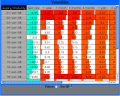

#A Magic Table

- Author: By Dr Greg Ross
- Homepage: http://www.grvisualisation.50webs.com/examples.html
- Legacy Code repository: http://code.google.com/p/magic-table

## See more of your data at a glance
The **Magic Table** is a JavaScript library that allows you to see more in your data by applying some simple visual techniques to transform a table.

## See more of your data at a glance

The Magic Table is a JavaScript library that allows you to see more in your data by applying some simple visual techniques to transform a table.

## Information Visualisation

The examples show how you can obtain a barchart or scatterplot view in the table as well as a novel approach to displaying a lot more of your data without using up much valuable screen real estate. The latter technique has adopted the concept of spatial distortion, using a fisheye lens model. Reducing the row height and column widths so that all of the cells become visible and using colour to encode the cell values affords the user an informative overview of all the data in one go. By moving a lens over this overview we can magnify the cells under the lens so that we obtain detail within the overview.

## Google visualisation API

The library has now also been wrapped in Google's visualisation API. Here's an example of how to use it this way.

## Easy to use

Download or checkout the code and follow the walk-through or the example web pages to quickly create a magic table.

## Browsers

The library has been tested in Firefox, Opera, Safari and Chrome. It's super-fast in Safari. However, since it uses the canvas element, it does not work in Interner Explorer. I tried to get it to work with ExplorerCanvas but IE is stupendously slow when it comes to VML path rendering. In fact, Internet Snorer is around 10 orders of magnitude slower than Safari! Alas, I decided not to continue my effort in making it compatible with IE. Instead, it is intended that the library is used in applications that have, wisely, embedded a non-IE browser engine such as Gecko or Presto.
